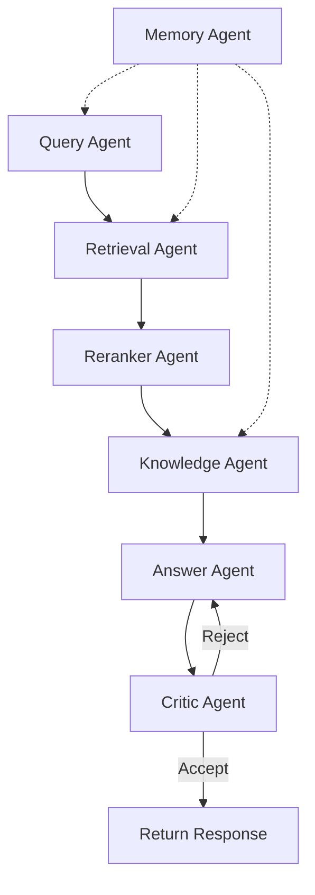

# RAG-CRM — Architecture Document

## Overview

Hybrid RAG (Retrieval-Augmented Generation) platform. Combines semantic search,
keyword search, reranking, and multi-agent processing to answer questions over
ingested documents. Designed as a learning project following production-grade
engineering principles.

---

## System Architecture

```
┌─────────────────────────────────────────────────────────────┐
│                        User                                  │
└──────────┬──────────────────────────────────┬────────────────┘
           │ Query                            │ Upload documents
           ▼                                  ▼
┌──────────────────────┐        ┌──────────────────────────────┐
│   FastAPI Gateway    │        │   Document Ingestion API     │
│   POST /query        │        │   POST /documents/upload     │
└──────────┬───────────┘        └──────────────┬───────────────┘
           │                                   │
           ▼                                   ▼
┌──────────────────────┐        ┌──────────────────────────────┐
│   LangGraph State    │        │   Ingestion Pipeline          │
│   Machine            │        │   Parse → Clean → Chunk →    │
│                      │        │   Embed → Index → Summarize  │
├──────────────────────┤        └──────────────┬───────────────┘
│ Query Agent          │                       │
│ Retrieval Agent      │                       ▼
│ Reranker Agent       │        ┌──────────────────────────────┐
│ Knowledge Agent      │        │   PostgreSQL + pgvector      │
│ Answer Agent         │        │   + BM25 (rank_bm25)         │
│ Critic Agent         │        └──────────────────────────────┘
│ Memory Agent         │                       ▲
└──────────────────────┘                       │
           │                                   │
           ▼                                   │
┌──────────────────────┐                       │
│   LLM (DeepSeek/     │───────────────────────┘
│    Ollama)           │
└──────────────────────┘
```

---

## Retrieval Pipeline

```
User Query
    │
    ▼
Query Expansion (optional, disabled by default)
    │
    ▼
┌─────────────────────────────────────────┐
│         Parallel Retrieval              │
├───────────────────┬─────────────────────┤
│  Semantic Search  │    BM25 Search      │
│  (pgvector)       │    (rank_bm25)      │
└───────────────────┴─────────────────────┘
    │                       │
    └───────────┬───────────┘
                ▼
    Reciprocal Rank Fusion (RRF)
                │
                ▼
    BGE-Reranker (cross-encoder)
                │
                ▼
    Context Builder  →  Answer Generation
```

---

## Agent Architecture



---

## Knowledge Layers

| Layer | Storage | Content | Maintainer |
|---|---|---|---|
| Raw Sources | `raw/` | Original documents (PDF, MD, TXT) | Ingestion Pipeline |
| Wiki Knowledge | `wiki/` (markdown) + pgvector | Auto-generated document summaries | Knowledge Agent |
| Memory System | PostgreSQL + `memory/` | Session/Episodic/Semantic/Project | Memory Agent |
| Generated Responses | `artifacts/` | Archived query results | Answer Agent |

---

## Memory System

| Type | Store | Written By | Trigger |
|---|---|---|---|
| Session | PostgreSQL | Middleware | Automatically, every query |
| Episodic | PostgreSQL | Memory Agent | After query completion |
| Semantic | PostgreSQL + pgvector | Knowledge Agent | When new facts extracted |
| Project | Markdown (`DECISIONS.md`) | Manual / Critic Agent | After architectural decisions |

---

## QA Strategy (from Habr articles)

1. **Three independent witnesses** — Answer Agent (LLM1) + Critic Agent (LLM2) + Python oracle
2. **Blind evaluation** — Critic agent does NOT see the expected answer
3. **Step-by-step with JSON** — Every answer includes structured intermediate reasoning
4. **Anchor tests** — 5-10 known queries must pass before new feature accepted
5. **Invariants** — Property-based checks (non-null, source cited, confidence > threshold)
6. **Temperature 0** — For all factual/retrieval generation
7. **"I don't know" allowed** — Explicit permission for model to refuse
